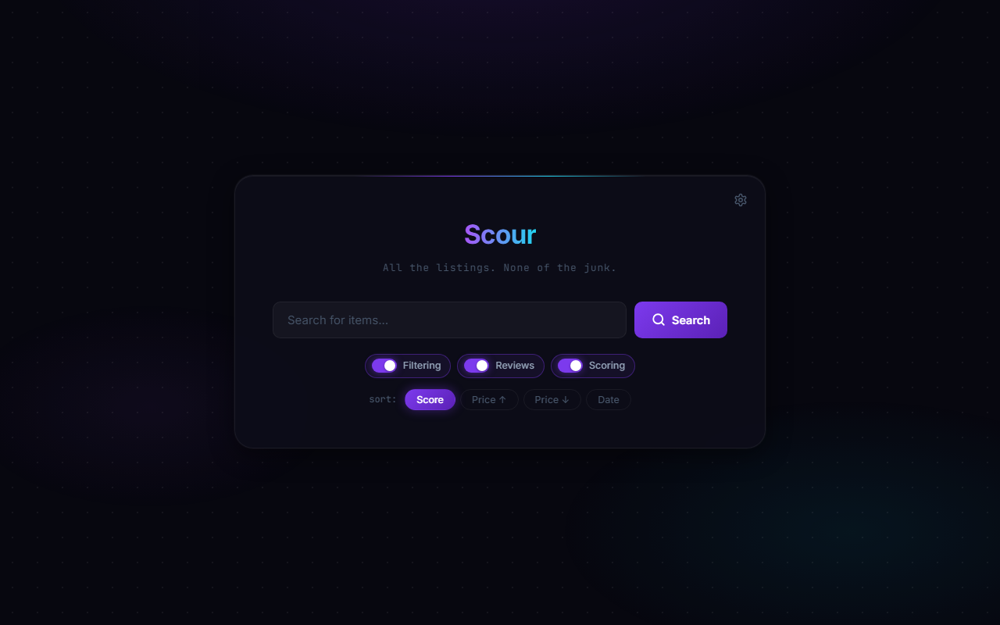
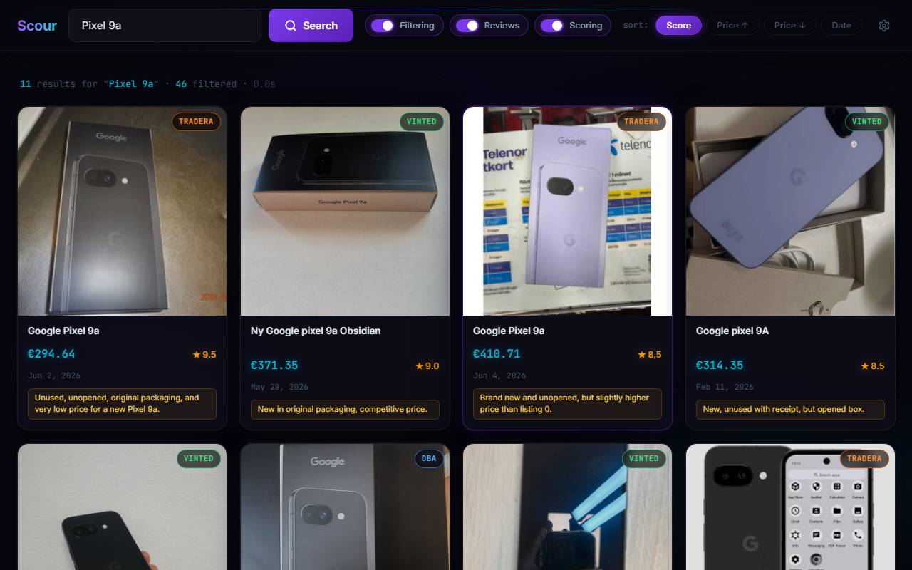

# Scour

> All the listings. None of the junk.

Scrapes DBA, Vinted, and Tradera simultaneously, then uses an LLM to filter, score, and summarize results.





## Installation

```bash
git clone https://github.com/pbozhok/second_hand_searcher.git
cd second_hand_searcher
python -m venv venv
venv\Scripts\activate        # Windows
# source venv/bin/activate   # macOS/Linux
pip install httpx beautifulsoup4 rich python-dotenv requests mistralai vinted-scraper
```

## Configuration

Create a `.env` file in the project root:

```env
# Required — pick one LLM backend (or both)
GOOGLE_API_KEY=your_gemini_api_key
MISTRAL_API_KEY=your_mistral_api_key

# Optional — improves review extraction (falls back to DuckDuckGo without it)
SERPAPI_KEY=your_serpapi_key
```

> Gemini requires the [Gemini CLI](https://github.com/google/gemini-cli) to be installed and authenticated.

## CLI Usage

```bash
python second_hand_research.py "iPhone 13 Pro"
python second_hand_research.py "Sony WH-1000XM5" --llm mistral --currency DKK
python second_hand_research.py "Nikon Z6" --no-filter --no-score --no-reviews  # fast, no AI
```

| Option | Description | Default |
|--------|-------------|---------|
| `--llm` | LLM backend: `gemini` or `mistral` | `gemini` |
| `--currency` | `EUR`, `DKK`, or `SEK` | `EUR` |
| `--no-filter` | Skip LLM relevance filtering | off |
| `--no-score` | Skip LLM scoring (sorts by price) | off |
| `--no-reviews` | Skip review extraction | off |
| `--debug` | Verbose logging | off |

## Web Interface

```bash
pip install fastapi uvicorn
uvicorn web.backend.main:app --reload --port 8000
# Open http://localhost:8000
```

Interactive API docs are available at `http://localhost:8000/api/docs`.

## Testing

```bash
make test              # backend + frontend
make test-backend      # API tests only
make test-frontend     # Playwright/Chromium tests only
```

Install Chromium once for frontend tests:

```bash
python -m playwright install chromium
```

## Environment Variables

| Variable | Required | Description |
|----------|----------|-------------|
| `GOOGLE_API_KEY` / `GEMINI_API_KEY` | For Gemini | Google Gemini API key |
| `MISTRAL_API_KEY` | For Mistral | Mistral AI API key |
| `SERPAPI_KEY` | No | Better review search results |
| `WEB_HOST` | No | Web server host (default: `0.0.0.0`) |
| `WEB_PORT` | No | Web server port (default: `8000`) |
